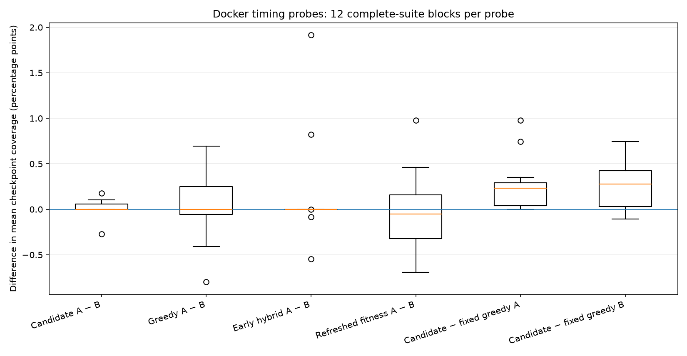
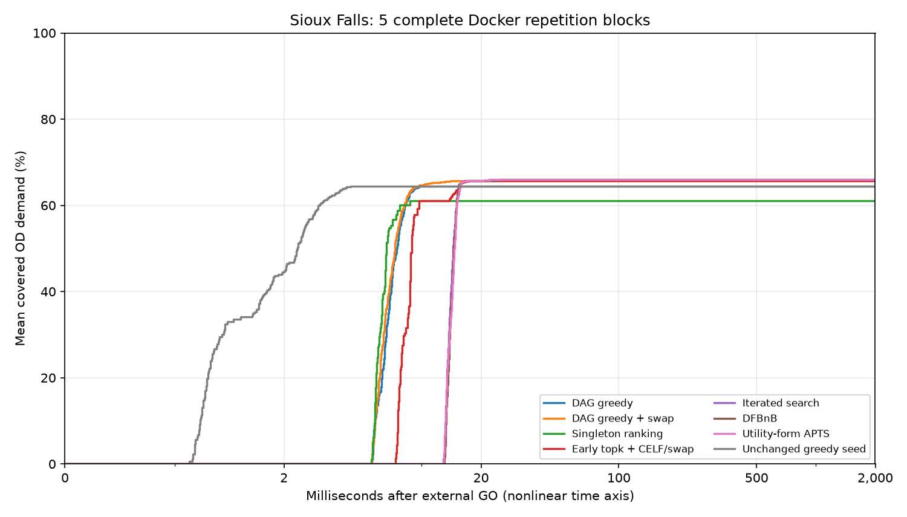
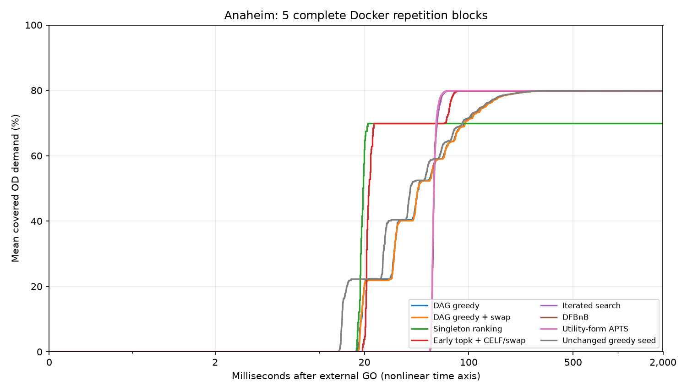
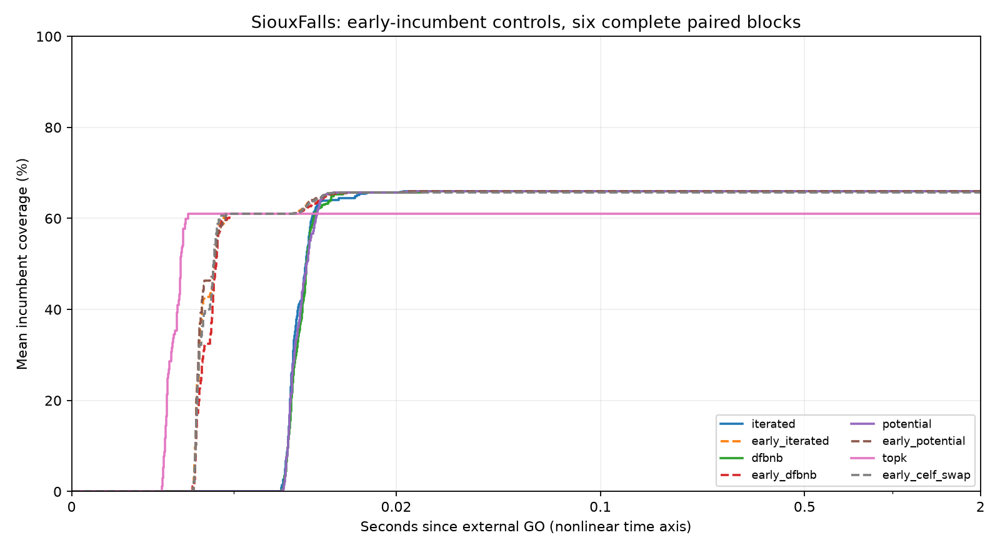
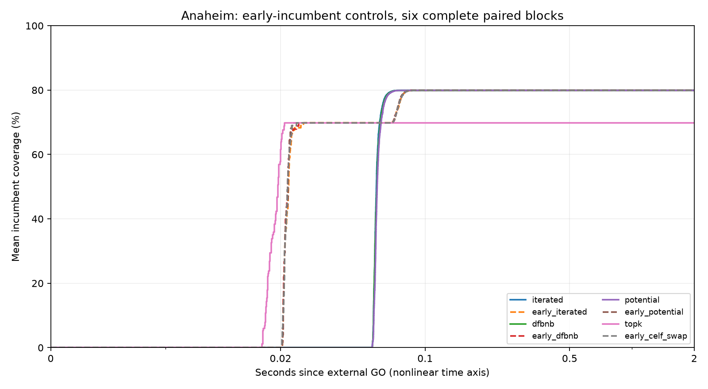

# Shinka Swarm Location
## A chapter-grounded benchmark for evolving network-monitor deployment algorithms

**Status: M7 task-aware mutation/meta feedback and bounded repair diagnostics implemented and verified. Section 5.9 reports functional integration, not improved evolutionary performance. No evolutionary campaign completed.**

### Abstract

This project investigates whether LLM-guided program evolution can improve the
quality-runtime trade-off of network-monitor placement. Its mathematical starting
point is Chapter 4 of *Applied Swarm Intelligence*, especially Section 4.7.4 [1].
The intended evolving object is a reusable search procedure that selects monitoring
locations on a directed transportation network, rather than a fixed deployment or
a drone flight controller. The first milestone implements endpoint-inclusive,
origin-destination-weighted group coverage, marginal-greedy deployment, comparison
algorithms, independent scoring, and an offline evaluation entrypoint. A documented
Sioux Falls benchmark substitution [3] establishes a working reference result. A
fixed one-for-one swap procedure improves on greedy at several monitor budgets;
for three and four monitors it matches exhaustive enumeration. These are baseline
results, not evidence of evolutionary improvement or large-scale generalization.

M2 adds an all-node marginal-gain backend that does not enumerate routes, externally
timed incumbent reporting, a hash-verified two-network development suite, strong
same-budget controls, and a launcher using the pinned native ShinkaEvolve runner.
The model remains fixed-route group coverage. Evidence is reported separately
from the untouched historical M1 calculations; no LLM-generated discovery is claimed.

| Research component | Current evidence |
|---|---|
| Chapter-grounded coverage objective and marginal greedy | Implemented; source deviations documented |
| Directed, tied-shortest-path, endpoint-inclusive evaluator | Implemented and cross-checked |
| Baseline results on a pinned public debugging network | Executed; artifacts committed |
| Local M1 seed-program evaluator | Executed; seed equals reference greedy |
| Native `run_shinka_eval` adapter | Subsequently executed in M2 commissioning; no model calls |
| Independent anytime worker / fast DAG gains | Implemented; M2 checks and measured results below |
| Native scheduler and full-run configuration | Seed path checked separately from unexecuted paid evolution |
| Coverage + verified quality certificates | Implemented separately; see Section 5.3 |
| Exact exchange landscape | Exhaustive development diagnosis and verified escape barrier; Section 5.4 |
| Strong fixed anytime controls | DFBnB, utility-form APTS, route greedy/CELF, refinement and iterated search; Section 5.5 |
| Staged native campaign comparisons | Four screening and seven assessment controls; Section 5.6 |
| Docker timing calibration | 2,688 trials; empirical host-session guard; Section 5.7 |
| Early-incumbent control ablation | 1,296 Docker trials; three paired variants; no checkpoint-score improvement; Section 5.8 |
| Opt-in M6 assessment profile | Four screening and ten assessment controls; no research holdout evaluation |
| Task-specific mutation/meta context and bounded repair diagnostics | M7 implementation and verification; Section 5.9 |
| LLM-generated descendants / evolutionary runs | **0 / 0** |
| Original Israeli-network numerical reproduction | Original code/data not recovered |
| Matched-time comparison | Two development networks; no validation/test result |

## 1. Research question

> Can ShinkaEvolve discover a reusable anytime search procedure that achieves
> greater covered OD demand, or comparable coverage sooner, than strong fixed
> deployment algorithms on previously unseen transportation-network instances?

The intended outer search evolves algorithms. Each candidate's inner search selects
monitor locations. A future champion is therefore executable deployment-search
code, not a particular junction set, an individual drone, or an evolved road graph.
The current milestone establishes the task and reference algorithms before testing
this research question. It does not claim a novel algorithm.

## 2. Mathematical model and source fidelity

Let $G=(V,E)$ be a directed graph with positive edge costs and let $D_{st}$ denote
nonnegative origin-destination demand. Let $\sigma_{st}$ be the number of shortest
routes from $s$ to $t$, and $\sigma_{st}(S)$ the number encountering at least one
monitor in $S\subseteq V$. The deployment objective is

$$
C(S)=\frac{\sum_{s,t}D_{st}\,\sigma_{st}(S)/\sigma_{st}}
{\sum_{s,t}D_{st}},\qquad |S|\leq k.
$$

A route is counted once even if it encounters several monitors. Origins and
destinations count as monitoring opportunities, following Section 4.7.1 [1].
For each OD pair, demand is distributed uniformly over all equally short routes.
That is a modeling convention, not measured route-choice behavior.

**Explicit emendation.** The printed Equation 4.15 on p. 198 inverts the route
fraction. This implementation uses covered routes divided by total routes,
consistent with the surrounding definition. The correction is documented; it is
not presented as author-confirmed errata. Further Gompertz discrepancies are
recorded in [the source-fidelity note](docs/source_fidelity.md), but Gompertz curves
and the economic fleet-size model are not used as fitness in this milestone.

Monitor placement does **not** delete junctions or change routes. Recomputing
shortest paths after removing monitors would evaluate a different problem.
No drone kinematics, decentralized sensing, threat pursuit, or real-world detection
outcome is modeled here. Equal fixed monitor quality and a fixed location budget
isolate the placement problem.

## 3. Data and implementation

### 3.1 M1 commissioning dataset

| Property | Value |
|---|---:|
| Benchmark | Sioux Falls, free-flow routing |
| Nodes / eligible locations | 24 |
| Directed edges | 76 |
| Positive OD pairs | 528 |
| Total supplied OD demand | 360,600 |
| Exactly shortest routes across positive OD pairs | 564 |
| Distinct node-set route masks after exact aggregation | 282 |
| Monitor budgets | 1 through 8 |

Upstream commit: `977ee75c6906337c0c7d229a1336107c7cdb533e`.
Both source TNTP files were verified against their upstream Git blob hashes. The
conversion script preserves free-flow edge costs, positive OD entries, directed
links, and TNTP centroid-through restrictions. The committed fixture and each
result carry provenance or content hashes. See [data provenance](data/README.md).

**This is a substitution, not the chapter's empirical dataset.** Its maintainers
explicitly describe Sioux Falls as a debugging network that is not realistic [3].
The results do not establish contemporary traffic conditions or large-scale
infrastructure performance. None of this network is held out from development.

### 3.2 Coverage calculation

`ShortestPathCoverage` builds a shortest-path directed acyclic graph for each
positive-demand origin. It counts original shortest routes that avoid the
monitored set and subtracts that count from the total. Rational arithmetic
(`Fraction`) decides edge-distance ties; integer arithmetic counts paths. Demand
aggregation and reported coverage use double precision.

For this small benchmark, `compile_routes()` also produces an equivalent weighted
route-mask representation. This enumerates **all** shortest routes, never a sample,
and fails explicitly above a configurable route-count limit. The independent
DAG scorer recalculates candidate coverage. M1's route-mask path is retained for
historical reproduction. M2 uses the DAG backend without route enumeration; this
does not establish scaling to arbitrary large networks.

### 3.3 Reference algorithms

| Algorithm | Method | Relationship to chapter |
|---|---|---|
| Random | Uniformly choose $k$ distinct locations | Random deployment reference |
| Individual BC | Rank singleton OD-weighted, endpoint-inclusive coverage | Individual-centrality comparison under the fixed routing model |
| Greedy GBC | Repeatedly maximize marginal group coverage | Section 4.7.4 rule |
| Greedy + swap | Greedy followed by improving best one-for-one exchanges | Additional fixed control, not a chapter algorithm |
| Exhaustive | Score every size-$k$ subset | Small-instance reference; not DFBnB or Potential Search |

Greedy ties use the smallest node ID. Swap accepts coverage gains exceeding
$10^{-12}$. Exhaustive search is run only for $k=1,2,3,4$, checking respectively
24, 276, 2,024, and 10,626 groups. Reported optima are exhaustive best values under
the specified model and numerical scoring, not general guarantees for other data.

## 4. Historical M1 experimental protocol

The commissioning comparison uses the fixed unperturbed fixture, all eight monitor
budgets, and 100 independent pseudorandom seeds (0-99) for random deployment at
each budget. Deterministic algorithms are run once per budget. Random mean and
sample standard deviation describe variation between deployments of this same
network; they are not cross-network confidence intervals. Per-seed coverage values
are preserved in `results/step1/random_coverages.json`.

Deterministic solver timings are recorded for transparency, with shared
preprocessing reported separately. They are single descriptive measurements,
**not** a matched-runtime, anytime, or hardware-normalized comparison. The swap
algorithm receives more computation than greedy in this baseline run.

`evaluate.py` separately executes the reviewed `initial.py` seed in a local child
process for each budget, validates returned node IDs and cardinality, and computes
coverage in the parent. Candidate-reported scores are never accepted. Invalid
runs overwrite any stale success artifacts with a failure record.

The historical M1 commissioning fitness is simply

$$
F_{\mathrm{step1}}(A)=\frac{100}{8}\sum_{k=1}^{8} C(S_A(k)).
$$

It is explicitly **not** the multi-network anytime research fitness.

## 5. Historical M1 measured results

<!-- RESULTS-TABLE:START -->

| Monitors | Random mean +/- SD (%) | Individual BC (%) | Greedy GBC (%) | Greedy + swap (%) | Exact optimum (%) |
|---:|---:|---:|---:|---:|---:|
| 1 | 14.1409 +/- 6.8813 | 34.0821 | 34.0821 | 34.0821 | 34.0821 |
| 2 | 28.1061 +/- 9.5055 | 49.1126 | 50.9151 | 50.9151 | 50.9151 |
| 3 | 38.3775 +/- 10.0760 | 62.0078 | 64.5036 | 66.9163 | 66.9163 |
| 4 | 47.8939 +/- 10.1784 | 69.4121 | 73.4332 | 74.6811 | 74.6811 |
| 5 | 56.4010 +/- 10.4239 | 76.8719 | 80.2551 | 81.4199 | Not computed |
| 6 | 63.3441 +/- 9.6615 | 78.7576 | 85.8014 | 86.9662 | Not computed |
| 7 | 69.5695 +/- 9.0743 | 79.4232 | 91.0704 | 91.0704 | Not computed |
| 8 | 75.4053 +/- 8.5999 | 86.2451 | 93.8991 | 94.2318 | Not computed |

<!-- RESULTS-TABLE:END -->

The seed's mean coverage over the eight budgets is **71.745008%**, with **0.000000
percentage-point difference** from reference greedy, as expected from the same
selection rule. For three monitors, fixed swap improves coverage from **64.5036%**
to **66.9163%** and matches exhaustive enumeration. For four monitors it likewise
matches the computed optimum. These observations show a greedy gap on this
benchmark, but also show that a straightforward fixed improvement procedure can
close it. Any later evolutionary claim must compare against that stronger control,
not only against random placement or plain greedy.

**No ShinkaEvolve improvement is claimed.** No LLM calls, evolved descendants,
train/validation/test selection, or held-out champion evaluations occurred.

### Evidence files

- [Baseline measurements and source hashes](results/step1/baselines.json)
- [Random-deployment per-seed coverage](results/step1/random_coverages.json)
- [Seed metrics](results/step1/seed/metrics.json) and [correctness record](results/step1/seed/correct.json)
- [Local test transcript](results/step1/tests.txt)

The local M1 suite passed **23 tests** on Python **3.13.5**. It includes independent
all-simple-path enumeration on 10 small directed graphs, comparing both backends
on all 64 monitoring subsets per graph. Other checks cover decimal ties, unequal
branching with uniform route weighting, endpoints, overlap, no rerouting,
centroid restrictions, invalid outputs, and a compact DAG with $2^{26}$ shortest
routes. Passing these checks supports implementation correctness for the tested
cases, not empirical validity of the transportation assumptions.

## 5.1 M2 anytime method and executed evidence

The new candidate contract is `solve(problem, k, random_seed, report, time_budget)`
in [`anytime_initial.py`](anytime_initial.py). A candidate evolves its deployment
search; it does not evolve the graph, routing, coverage measure, or evaluation clock.
[`SearchProblem`](swarm_location/search.py) computes all marginal gains in two
passes over each original shortest-path DAG. It uses no route sampling or route
enumeration. The original M1 avoiding-path scorer independently checks submitted
deployments. The derivation, arithmetic assumptions, timing semantics, and research
sources are in [the M2 methods note](docs/m2_method.md).

A parent process starts the search clock after common fixed DAG preprocessing,
before candidate import. It stamps each complete received incumbent, kills the
process group at the deadline, and retains the best valid earlier submission.
Partial groups are allowed under the same `|S| <= k` constraint. Scoring is deferred
until capture finishes; candidate-reported scores and timestamps are rejected.
This is a **warm prepared-problem** comparison, not an end-to-end latency claim.
Common startup/preprocessing is recorded separately.

The pinned public development suite contains Sioux Falls (24 nodes, 76 directed
links) and Anaheim's historical 1992 network (416 nodes, 914 directed links).
Sioux Falls budgets are 1, 3, 4, 6; Anaheim budgets are 3, 6, 12, 24. Each uses
seeds 0, 1, 2 and checkpoints 0.02, 0.10, 0.50, 2.00 seconds: **24 paired cases**.
The parser preserves positive demands, exact free-flow edge weights, and centroid
through-node restrictions, verifying original Git hashes and prepared-data SHA-256.
**Neither network is held out.** A suite can declare whole-source-graph partitions;
relabelled or perturbed copies must retain their source identity.

The research statistic is mean checkpoint improvement over same-budget greedy,
in percentage points. Native `combined_score` is `100 + improvement`; the +100 is
an affine shift, not a second objective. Fixed greedy+swap is also reported. Any
candidate or reference failure invalidates that evaluation instead of being omitted.
Identical-rule seed and greedy runs can differ at early checkpoints due to imports,
OS scheduling and message-receipt jitter. Tiny timing differences are not discovery.

<!-- M2-RESULTS:START -->

| Development dataset | Method | Mean checkpoint coverage (%) | Mean final coverage (%) |
|---|---|---:|---:|
| Anaheim | greedy | 63.3847 | 79.9092 |
| Anaheim | greedy_swap | 63.3849 | 79.9100 |
| Anaheim | random | 33.6964 | 33.6964 |
| Anaheim | topk | 69.8779 | 69.8779 |
| SiouxFalls | greedy | 64.4551 | 64.4551 |
| SiouxFalls | greedy_swap | 65.6614 | 65.6614 |
| SiouxFalls | random | 32.6724 | 32.6724 |
| SiouxFalls | topk | 61.0649 | 61.0649 |

| Dataset | Reference gain pass (median ms) | Reverse-dependency pass (median ms) | Speed ratio | Max. absolute difference |
|---|---:|---:|---:|---:|
| SiouxFalls | 7.6442 | 0.4874 | 15.68x | 0 |
| Anaheim | 2568.0292 | 12.9373 | 198.50x | 2.78e-17 |

**Executed evidence:** 47 tests passed; 24 paired cases; 2 development source networks; zero failed baseline trials. Native seed correctness: `True`; native score: `100.231474`. The native score includes a +100 affine offset; its checkpoint difference can vary with timing.

[Protocol and raw baseline trajectories](results/step2/ci/baselines/traces.json), [baseline metrics](results/step2/ci/baselines/metrics.json), [native integration record](results/step2/ci/native/native_seed_check.json), [native seed metrics](results/step2/ci/native/seed/metrics.json), [gain-pass timings](results/step2/ci/marginals.json), and [tests](results/step2/ci/tests.txt).

These are fixed-baseline and reviewed-seed calculations, not evolved results. The gain-pass comparison uses three alternating-order measurements at the empty selection; its speed ratio is not an end-to-end algorithm speedup. The tables average budgets and seeds within each dataset and do not establish cross-network confidence intervals.

<!-- M2-RESULTS:END -->

## 5.2 M3 whole-network holdouts and native campaign

M3 continues the same objective and evaluator rather than rebuilding them. The
new [source catalog](configs/source_catalog_m3.json) keeps Sioux Falls and Anaheim
as development data, assigns the complete published Eastern Massachusetts highway
benchmark to validation, and reserves Barcelona for test. The complete published
benchmark is used, not a random subset of its nodes. EMA itself is a highway
subnetwork, not every road in the region.

The [M3 protocol and research note](docs/m3_protocol.md) explains source selection,
excluded incompatible datasets, recorded header-roundoff handling, native model
configuration, validation selection and one-time test access. It distinguishes
new project decisions from Chapter 4 and preserves the historical M1/M2 results.
Winnipeg, Berlin-Tiergarten and Chicago-Sketch are not silently simplified to fit
our model. No positive trip is dropped, no zero-time link receives an invented
epsilon weight, and the coverage objective is unchanged.

`campaign.py` invokes the pinned **native** runner using the existing anytime
entrypoint. It does not generate substitute descendants. After a real native run,
it freezes at most five development leaders plus the original seed, evaluates that
fixed shortlist on validation, freezes one program, and only then evaluates test
performance. Code, source-family, suite, population and container identities are
checked. Both held-out graphs remain unscored until their corresponding stage.

The worker now has an opt-in Docker backend: no network, non-root, read-only code
and root filesystem, no host-repository/secret/socket mount, bounded resources and
explicit immutable image identity. The existing parent clock and independent
scorer remain in charge. Docker startup is outside the warm search budget and
is recorded in total trial cost. Controlled probes are not a formal security proof.

<!-- M3-RESULTS:START -->

| Source network | Partition | Nodes | Directed links | Positive OD pairs |
|---|---|---:|---:|---:|
| SiouxFalls | development | 24 | 76 | 528 |
| Anaheim | development | 416 | 914 | 1406 |
| Eastern-Massachusetts | validation | 74 | 258 | 1113 |
| Barcelona | test | 1020 | 2522 | 7922 |

**Measured software evidence:** 63 tests passed; Docker containment/deadline probes passed; native development seed completed 24 paired cases successfully. The seed run made zero model calls and is not an evolutionary result.

**Campaign state: `blocked_model_access`.** Native evolutionary runner started: `False`. Recorded campaign inference calls: `0`; valid evolved descendants: `0`. Validation solver trials: `0`; test solver trials: `0`.

For `blocked_model_access`, no model credential was available to the verified native preflight. No validation/test performance or champion is fabricated to fill that gap.

[Summary](results/step3/ci/summary.json), [input audit](results/step3/ci/audit/data_audit.json), [container probes](results/step3/ci/container.json), [native seed](results/step3/ci/native/native_seed_check.json), [campaign status](results/step3/ci/campaign/campaign_status.json), and [test transcript](results/step3/ci/tests.txt).

<!-- M3-RESULTS:END -->

### Execute the first bounded campaign

The explicit request targets 100 native slots, four islands and a $3 submission
threshold with a two-model mutation pool. It is neither a claim of completed
generations nor a guarantee that 100 slots fit that cost. See
[`configs/m3_launch_request.json`](configs/m3_launch_request.json). The threshold
may overshoot with in-flight calls; there is no automatic top-up or fallback.
Mutation-model bandit selection remains separate from interpretation-model routing.

With an authenticated model route available securely in the execution environment:

```bash
python -m pip install -e . -r requirements-shinka.txt
docker pull python:3.11-slim
IMAGE_ID=$(docker image inspect python:3.11-slim --format '{{.Id}}')
python campaign.py --execute --download --docker-image "$IMAGE_ID" \
  --output results/local_m3_campaign
```

The driver materializes development data first and does not open validation/test
performance during evolution. Without its required model credential it exits with
`blocked_model_access` before inference. Put credentials in environment variables
or repository Actions secrets, never in source files or the chat. The GitHub
**M3 research** workflow also supports an explicit manual campaign request; ordinary
check reruns do not automatically spend a provider budget. A started/interrupted
campaign is preserved, not silently overwritten; continuation must retain its
original native manifest and separately document any interrupted holdout assessment.

## 5.3 Coverage plus independently verified quality certificates

The certificate perspective from Chapter 4, printed p. 200 and Figure 4.11, is now
implemented as a separate, tested reporting path. For **any** feasible deployment
with coverage L and a verified upper bound U on the optimum, L/U is a guaranteed
lower bound on its fraction of optimal coverage. Coverage and certified quality
are reported separately, alongside an interval for remaining possible improvement.

The general method computes exact-rational submodular upper bounds on the original
shortest-path DAGs, without enumerating routes. Optional small-instance DFBnB
partition proofs and exactly checked LP-dual witnesses supply stronger reference
bounds. None relies on an LLM judgment or accepts a candidate's claimed score.
See [the mathematical derivation and source mapping](docs/quality_certificates.md).

This adds **posthoc certificates**, not a new fitness. The production scorer,
checkpoints, mutable seed, campaign configuration and historical M1/M2/M3 evidence
remain unchanged. A certificate attached to a past checkpoint uses an offline
bound; it is not a claim that the solver had that bound available at that time.
No validation/test performance was evaluated and no evolutionary run was started.

<!-- QUALITY-CERTIFICATES:START -->

| Development network | Monitors | Completed swap coverage (%) | Verified optimum upper bound (%) | Quality guarantee (%) | Remaining gain at most (pp) |
|---|---:|---:|---:|---:|---:|
| SiouxFalls | 1 | 34.082085 | 34.082086 | 100.000000 | 0.000000 |
| SiouxFalls | 2 | 50.915141 | 50.915142 | 100.000000 | 0.000000 |
| SiouxFalls | 3 | 66.916251 | 66.916251 | 100.000000 | 0.000000 |
| SiouxFalls | 4 | 74.681087 | 74.681088 | 100.000000 | 0.000000 |
| SiouxFalls | 5 | 81.419856 | 81.780367 | 99.559172 | 0.360511 |
| SiouxFalls | 6 | 86.966167 | 88.186357 | 98.616352 | 1.220189 |
| SiouxFalls | 7 | 91.070438 | 91.735996 | 99.274486 | 0.665558 |
| SiouxFalls | 8 | 94.231836 | 94.647810 | 99.560503 | 0.415974 |
| Anaheim | 3 | 52.468327 | 52.468327 | 99.999999 | 0.000001 |
| Anaheim | 6 | 74.498063 | 75.054206 | 99.259012 | 0.556143 |
| Anaheim | 12 | 93.123701 | 94.166702 | 98.892388 | 1.043001 |
| Anaheim | 24 | 99.549833 | 100.000000 | 99.549832 | 0.450168 |

**Executed evidence:** 86 tests passed locally; 48 standalone certificates and 24 bound witnesses independently recomputed. 96 existing baseline trials received 384 checkpoint and 96 final certificates without running candidates or changing their recorded timing. All eight Sioux Falls reference optima were proved. Anaheim LP bounds are not automatically exact optima.

[Reference study and source hashes](results/quality-certificates/reference-study/study.json), [proof artifacts](results/quality-certificates/reference-study/references/), [posthoc M2 certificates](results/quality-certificates/m2-baseline-certificates.json), [verification](results/quality-certificates/verification.json), and [test transcript](results/quality-certificates/tests.txt).

<!-- QUALITY-CERTIFICATES:END -->

The table describes **completed fixed greedy+swap** on development cases, not a
new matched-runtime comparison. Sioux Falls k=2,5,7,8 are supplementary reference
budgets, not additions to the frozen campaign. Upper bounds are rounded up and
quality guarantees down; exact proof flags use rational equality, never displayed
rounding. An upper bound can be loose: its gap is not a promise of achievable gain.

For example, at six monitors in Sioux Falls, fixed swap covers about 86.9662% of
demand and is certified to reach at least 98.6163% of the optimum. The proved
optimum covers about 88.1864%. That leaves an actual gap of about 1.2202 percentage
points. This is a baseline/reference finding, **not an evolved discovery**.

Reproduce this first certificate study (no API keys or model calls):

```bash
python scripts/prepare_suite.py --download
python -m pip install -r requirements-certificates.txt   # Optional LP proposals.
python scripts/quality_study.py --suite data/commissioning/suite.json \
  --output results/local_quality --exact-small --extended-small --lp
python scripts/quality_study.py --suite data/commissioning/suite.json \
  --output results/local_quality --verify
python certify.py --suite data/commissioning/suite.json \
  --traces results/step2/ci/baselines/traces.json \
  --reference-dir results/local_quality/references \
  --output results/local_quality/m2-sidecar.json
```

Omit `--lp` to use only standard-library bounds and small-instance proof search.
Omit `--reference-dir` for generic DAG bounds without precomputed references.
`certify.py` requires a completed trace with exactly matching suite/data hashes;
its new output must not already exist. It never executes the candidate program.

For a deployment already available in Python:

```python
from swarm_location.core import Instance
from swarm_location.certificates import ExactCoverage, certificate

problem = ExactCoverage(Instance.load("data/sioux_falls.json"))
report = certificate(problem, selected=[3, 7, 12], k=3)
print(report["coverage_pct"], report["quality_lower_bound_pct"])
```

Those IDs are an arbitrary feasible example, not the champion or an optimality
claim. Supply verified reference witnesses to tighten the default bound. The
code records exact loaded floating-point demand as rationals rather than silently
reinterpreting the source decimals; this distinction is documented in the methods.

## 5.4 Exact headroom and exchange-landscape diagnosis

The exact Sioux Falls optima for budgets 1–8 and the quality certificates were
already implemented in Section 5.3. This additional development-only study
reuses and independently verifies those reference proofs; it does not present
another implementation of branch and bound as new progress.

The new contribution is a complete exchange census around the six-monitor
completed greedy+swap deployment, exhaustive exploration of its neutral plateau,
and a path-plus-cut proof of the smallest temporary loss required for a sequence
of one-for-one replacements to escape. All comparisons use exact integer mass.
This is an exploratory diagnosis of a selected development case, not an evolved
algorithm or the chapter's original Israeli-network experiment. The production
evaluator, fixed controls, seeds, fitness and held-out performance remain unchanged.
See [the definitions, proof and source distinction](docs/exchange_landscape.md).

<!-- EXCHANGE-LANDSCAPE:START -->

| Simultaneous replacements | Deployments checked | Worse | Equal | Better |
|---:|---:|---:|---:|---:|
| 1 | 108 | 107 | 1 | 0 |
| 2 | 2,295 | 2,295 | 0 | 0 |
| 3 | 16,320 | 16,320 | 0 | 0 |
| 4 | 45,900 | 45,899 | 0 | 1 |
| 5 | 51,408 | 51,406 | 0 | 2 |
| 6 | 18,564 | 18,564 | 0 | 0 |

**Executed evidence:** all 102 tests passed. The exact census covers **134,596** distinct 6-monitor deployments, including the starting deployment. Only **3** are strictly better; the smallest improving simultaneous exchange replaces **4** monitors.

The exactly neutral single-exchange component contains **2** deployments. Neither member has an improving exchange of one, two or three monitors. This closes the previously unexamined neutral-plateau question for this starting deployment.

For paths restricted to single-monitor replacements, the minimum temporary coverage drop needed to reach any strictly better deployment is **approximately 1.386578 percentage points**. A feasible path attains that bottleneck; an independently checked **18-state cut** proves that a smaller drop cannot suffice.

The drop concerns an exploratory working solution: the algorithm can retain and report its best deployment throughout. The proof is not a requirement to deploy a worse operational solution.

[Exact headroom table](results/exchange-landscape/headroom.md), [full census and path/cut witnesses](results/exchange-landscape/study.json), [independent verification](results/exchange-landscape/verification.json), and [test transcript](results/exchange-landscape/tests.txt).

<!-- EXCHANGE-LANDSCAPE:END -->

These results motivate testing larger exchanges or controlled temporary losses,
while preserving the best-so-far deployment. They do not prove that any particular
restart, evolutionary proposal, or heuristic will improve the timed campaign.
The hypothesis is about reusable search behavior, not hardcoding these node sets.

Reproduce without model calls (the two development files must be prepared):

```bash
python scripts/prepare_suite.py --download
python scripts/exchange_study.py --output results/local_exchange_study
python scripts/exchange_study.py --output results/local_exchange_study --verify
```

The complete census is deliberately limited to tractable small development cases;
large requests fail explicitly rather than becoming unreported samples. No new
algorithm is silently inserted into the frozen ShinkaEvolve campaign.

## 5.5 Strong fixed anytime controls and online bound reporting

The next missing scientific component was a stronger **timed** comparison, not
another offline optimum calculation. Chapter 4 names DFBnB and Potential Search;
the original Potential Search paper also includes group-betweenness maximization.
The implemented utility-form anytime adaptation is explicitly derived in
[the methods/source-mapping note](docs/strong_baselines.md). It is not recovered
author code or a numerical reproduction of the Israeli-network experiment.

Seven new fixed methods run through the existing external clock and independent
DAG scorer: exact route greedy, route CELF, route CELF plus strict single-node
swaps, an early complete topk answer followed by CELF/swap, seeded iterated search,
DFBnB, and utility-form anytime Potential Search (`potential`). Original singleton,
bulk-DAG greedy, and bulk-DAG greedy+swap controls remain unchanged. All seven
methods guard exact route enumeration and fall back to DAG search with only the
remaining time if their representation limits are exceeded; none samples routes.

The route-greedy/CELF pair isolates lazy evaluation from the representation change.
DFBnB and APTS share the same fully timed CELF+swap warm start; `route_swap` measures
that warm start without the tree. The iterated control changes a working solution
through larger perturbations and occasional restarts while preserving its best
reported deployment. It uses no known optimum, stored deployment or case-specific
escape threshold. This is fixed-code algorithm engineering, not LLM evolution.

For DFBnB and APTS, every reported upper bound comes with an incremental complete
search-space partition. Its calculation, journal serialization and transmission
are timed. The external parent timestamps the complete message and independently
checks the exact partition after capture. This is **a bound available during
search**, not an offline bound attached retroactively to a checkpoint. Candidate
programs cannot inject these trusted fixed-solver messages. Earlier valid bounds
remain usable if a deadline interrupts the latest expansion/message.

The development study compares ten methods on the unchanged M2 suite, repeating
each of its 24 network/budget/seed cases three times in reproducibly shuffled
orders: **72 paired cases and 720 timed trials**. Common DAG setup remains outside
the warm search budget; all method-specific imports, route preparation, warm
starts, search and reporting are inside it. The canonical comparison uses the GitHub-hosted
Linux process backend, not Docker. Raw measurements and source hashes are saved
before interpreting results; verification replays them rather than retiming them.

<!-- STRONG-BASELINES:START -->

| Development network | Fixed method | Mean checkpoint coverage (%) | Mean final coverage (%) | Online optimum proofs / trials |
|---|---|---:|---:|---:|
| Anaheim | Singleton ranking | 69.8779 | 69.8779 | Not emitted |
| Anaheim | DAG greedy | 63.3847 | 79.9092 | Not emitted |
| Anaheim | DAG greedy + swap | 63.3500 | 79.9100 | Not emitted |
| Anaheim | Route greedy | 59.9272 | 79.9092 | Not emitted |
| Anaheim | Route CELF | 59.9319 | 79.9092 | Not emitted |
| Anaheim | Route CELF + swap | 59.9325 | 79.9100 | Not emitted |
| Anaheim | Early topk + CELF/swap | 77.4018 | 79.9100 | Not emitted |
| Anaheim | Fixed iterated search | 59.9339 | 79.9146 | Not emitted |
| Anaheim | Anytime DFBnB | 59.9325 | 79.9100 | 18/36 |
| Anaheim | Utility-form APTS | 59.9325 | 79.9100 | 18/36 |
| SiouxFalls | Singleton ranking | 61.0649 | 61.0649 | Not emitted |
| SiouxFalls | DAG greedy | 64.4551 | 64.4551 | Not emitted |
| SiouxFalls | DAG greedy + swap | 65.6614 | 65.6614 | Not emitted |
| SiouxFalls | Route greedy | 64.4551 | 64.4551 | Not emitted |
| SiouxFalls | Route CELF | 64.4551 | 64.4551 | Not emitted |
| SiouxFalls | Route CELF + swap | 65.6614 | 65.6614 | Not emitted |
| SiouxFalls | Early topk + CELF/swap | 65.6614 | 65.6614 | Not emitted |
| SiouxFalls | Fixed iterated search | 65.9664 | 65.9664 | Not emitted |
| SiouxFalls | Anytime DFBnB | 65.8902 | 65.9664 | 36/36 |
| SiouxFalls | Utility-form APTS | 65.9580 | 65.9664 | 36/36 |

**Six-monitor Sioux Falls diagnostic within the timed comparison:**

| Fixed method | Mean final coverage (%) | Trials matching known optimum | Trials strictly above completed old swap |
|---|---:|---:|---:|
| Singleton ranking | 78.7576 | 0/9 | 0/9 |
| DAG greedy | 85.8014 | 0/9 | 0/9 |
| DAG greedy + swap | 86.9662 | 0/9 | 0/9 |
| Route greedy | 85.8014 | 0/9 | 0/9 |
| Route CELF | 85.8014 | 0/9 | 0/9 |
| Route CELF + swap | 86.9662 | 0/9 | 0/9 |
| Early topk + CELF/swap | 86.9662 | 0/9 | 0/9 |
| Fixed iterated search | 88.1864 | 9/9 | 9/9 |
| Anytime DFBnB | 88.1864 | 9/9 | 9/9 |
| Utility-form APTS | 88.1864 | 9/9 | 9/9 |

**Executed evidence:** 120 tests passed; 72 paired cases, 720 timed trials, 0 failed trials. Independent replay checked 6,231 reported deployments, 837 transmitted bound snapshots, and 576 checkpoint/bound pairs. Maximum exact-versus-production score difference: 1.11e-16.

These are fixed-code results on two development networks using the recorded Linux process backend. Means pool four budgets and nine repeat/seed combinations per network. Matching a known optimum uses a numerical comparison; the separate online-proof count requires exact equality of a verified bound and a feasible value. A hard deadline can retain an earlier, looser bound. No evolutionary superiority, statistical significance, Docker timing result or held-out transfer is implied.

[Full per-checkpoint comparison and timing costs](results/strong-baselines/comparison.md), [summary](results/strong-baselines/study/summary.json), [raw incumbent and bound journals](results/strong-baselines/study/trials.jsonl), [frozen measurement manifest](results/strong-baselines/study/manifest.json), [independent replay](results/strong-baselines/verification.json), and [test transcript](results/strong-baselines/tests.txt).

<!-- STRONG-BASELINES:END -->

### Interpretation

The independently executed canonical comparison is reported above. A local
720-trial precursor comparison using the same frozen solver code is summarized
separately in [local-precursor](results/strong-baselines/local-precursor/); its full
raw journals are retained in the associated delivery archive. The two host timings
are not pooled and neither run was selected for a more favorable outcome.

The per-checkpoint tables distinguish getting a full deployment out early from
improving the final answer or proving its quality. Differences between full route
greedy and CELF isolate lazy marginal reevaluation; differences from bulk-DAG
methods also include representation and implementation effects. The documented
six-monitor local trap is a useful diagnostic, not a held-out benchmark or an
invitation to hardcode its known solutions. A successful fixed method is a
stronger reference for future evolution, not evidence that evolution was needed.

Small timing differences require replication on the intended execution backend.
Three repeats and three seeds on one graph are not nine independent networks.
Online certificates can remain loose when interrupted; a solver's stopping label
is never accepted as proof. Stochastic/sampling controls remain deferred, not
implicitly implemented. Historical result files and frozen campaign settings
are not rewritten by this comparison.

### Reproduce or opt into the new comparisons

```bash
python scripts/prepare_suite.py --download
python -m unittest discover -s tests -v
python scripts/strong_baseline_study.py --output results/local_strong_baselines
python scripts/strong_baseline_study.py --output results/local_strong_baselines --verify
python scripts/update_strong_readme.py --check
```

Use a new output directory for a new measurement. The saved canonical run is
verified with `--output results/strong-baselines/study --verify`. The new study
and solver implementations use the standard library; the existing full test suite
also exercises the optional LP dependency in `requirements-certificates.txt`.

For an explicitly revised future campaign manifest, `extra_baselines` now accepts
`route_greedy`, `celf`, `route_swap`, `early_celf_swap`, `iterated`, `dfbnb`, and
`potential`, in addition to the existing optional controls. No new methods are
silently added to the current frozen campaign and the score remains the same
checkpoint-coverage difference from timed greedy. More comparator executions
increase evaluation cost; the submitted protocol must record that choice.

## 5.6 M4: stronger controls integrated into a versioned native campaign

The stronger fixed algorithms in Section 5.5 are now connected to an explicit
new campaign profile, rather than merely being available as optional evaluator
names. [`configs/comparisons_m4.json`](configs/comparisons_m4.json) defines the
sets below; [`configs/m4_launch_request.json`](configs/m4_launch_request.json)
selects that profile without rewriting the historical M3 request or defaults.
The [research and integration note](docs/m4_comparators.md) distinguishes the
chapter/literature basis from these project-specific experimental choices.

| Stage | Fixed controls compared with each candidate | Cases per candidate | Total solver invocations per candidate |
|---|---|---:|---:|
| Development screening | Greedy, greedy + swap, topk, early topk + CELF/swap | 24 | 120 |
| Validation assessment | Screening controls + iterated search, DFBnB, utility-form APTS | 40 | 320 |
| Frozen test assessment | Same seven controls as validation | 40 | 320 |

The counts are **protocol plans**, including one candidate trial per case, not
claims that validation or test performance has been measured. Each method gets
its own unchanged inner deadline. Using four rather than seven fixed controls
during development avoids 72 solver invocations per candidate on these cases;
this is not a measured runtime speedup. The full representation-ablation study
remains in Section 5.5 and is not rerun for every evolutionary proposal.

**Fitness is unchanged:** `100 + mean checkpoint improvement over timed greedy`
in percentage points. Strong controls do not become extra scalar rewards or
replace the reference with a retrospective oracle. Instead, each versioned
evaluation writes `comparisons.json`, exposes checkpoint/final differences from
each executed control in native public metrics, and gives the mutation/meta
context per-source/per-budget feedback. Screening feedback explicitly marks the
assessment controls that were not executed. Any failed required trial invalidates
the evaluation; no successful subset hides failures. Positive fitness against
greedy alone is not evidence of superiority over the stronger controls.

The complete profile and its hashes travel through prepared suites, native run
and campaign manifests, validation evidence and champion identity. Missing,
duplicated, unknown or stage-inconsistent controls fail explicitly. Cached
validation results must contain the declared comparisons; changing the test
assessment profile is rejected before test access. The seed, shortlist selection
rule, datasets, budgets, checkpoints, native island/bandit/meta settings, and
independent timing/scoring boundary are unchanged. M1–M3 result files and the
previous README result blocks are preserved.

<!-- M4-INTEGRATION:START -->

**Executed integration evidence:** 146 tests passed; the pinned native scheduler evaluated the unchanged greedy seed on 24 development cases with four fixed controls (**120 Docker-isolated solver trials, zero failures**). Independent replay rescored 924 submitted deployments and checked every staged comparison against its raw trajectories.

Continuity checks confirm **96 protected files** and all six historical README result blocks are byte-for-byte unchanged. Validation/test stage routing and fixed-control completeness were exercised only on explicitly labelled synthetic unit fixtures. **Model calls: 0; evolved descendants: 0; research validation/test solver trials: 0.**

[Integration summary](results/step4/integration/summary.json), [paired screening comparisons](results/step4/integration/native/seed/comparisons.json), [raw trajectories](results/step4/integration/native/seed/traces.json), [continuity record](results/step4/integration/continuity.json), and [test transcript](results/step4/integration/tests.txt).

<!-- M4-INTEGRATION:END -->

Inspect the development plan without model calls:

```bash
python scripts/prepare_research.py --split development --download \
  --comparison-profile configs/comparisons_m4.json --output data/commissioning_m4
python run_evo.py --config configs/evolution_m3.json \
  --suite data/commissioning_m4/suite.json --results-dir results/local_m4_plan
```

A later authorized campaign uses the new request explicitly:

```bash
python campaign.py --request configs/m4_launch_request.json \
  --execute --download --docker-image "$IMAGE_ID" --output results/local_m4_campaign
```

Use a newly named output directory and an immutable image ID. The inherited
100-slot target and $3 submission threshold are unchanged, not a guarantee of
sufficient search effort. No paid run is started by these integration checks.
Timing calibration on the intended host, repeated evolutionary runs and broader
network generalization remain separate research tasks.

## 5.7 M5: Docker timing calibration before evolutionary confirmation

The [predeclared timing protocol](docs/m5_timing.md) measures identical-code
variation and repeats all seven strong assessment controls on the **unchanged
campaign Docker backend**. It retains the existing four checkpoints and fitness.
The [configuration](configs/timing_m5.json) separates a finite, host-session
screening guard from proof of algorithmic improvement. Whole-suite repetitions,
not individual seeds or checkpoints, are the statistical reporting unit.

<!-- M5-TIMING:START -->

**Executed:** 12 complete null blocks and 5 complete strong-control blocks, 24 development cases per block; **2,688 Docker solver trials**, 0 failed trials. Independent replay rescored 22,835 deployments and 1,427 online bound snapshots.

| Suite-level timing probe (percentage points) | Mean | SD across blocks | Range |
|---|---:|---:|---:|
| identical_candidate | +0.0164 | 0.1069 | -0.2719 to +0.1792 |
| identical_fixed_greedy | +0.0429 | 0.4094 | -0.7989 to +0.6944 |
| identical_early_hybrid | +0.1754 | 0.6238 | -0.5465 to +1.9151 |
| refreshed_fitness_difference | -0.0265 | 0.4625 | -0.6944 to +0.9782 |
| candidate_minus_fixed_greedy_a | +0.2667 | 0.3065 | +0.0000 to +0.9782 |
| candidate_minus_fixed_greedy_b | +0.2932 | 0.2976 | -0.1045 to +0.7467 |

**Host-session promotion guard: strictly greater than 1.97 pp** over both freshly measured greedy and the early hybrid. The observed six-probe envelope was 1.9151 pp. This is a conservative **screening heuristic**, not statistical significance or proof of superiority. It does not alter Shinka fitness or automatically open holdouts.

| Network / method | 20 ms (%) | 100 ms (%) | 500 ms (%) | 2 s (%) | Mean checkpoints (%) |
|---|---:|---:|---:|---:|---:|
| Anaheim / greedy | 19.6290 | 71.3316 | 79.9092 | 79.9092 | 62.6947 |
| Anaheim / greedy_swap | 20.3697 | 71.0808 | 79.9092 | 79.9100 | 62.8174 |
| Anaheim / topk | 61.9042 | 69.8779 | 69.8779 | 69.8779 | 67.8845 |
| Anaheim / early_celf_swap | 3.7841 | 79.9092 | 79.9100 | 79.9100 | 60.8783 |
| Anaheim / iterated | 0.0000 | 79.9100 | 79.9123 | 79.9146 | 59.9342 |
| Anaheim / dfbnb | 0.0000 | 79.9100 | 79.9100 | 79.9100 | 59.9325 |
| Anaheim / potential | 0.0000 | 79.9100 | 79.9100 | 79.9100 | 59.9325 |
| SiouxFalls / greedy | 64.4551 | 64.4551 | 64.4551 | 64.4551 | 64.4551 |
| SiouxFalls / greedy_swap | 65.6614 | 65.6614 | 65.6614 | 65.6614 | 65.6614 |
| SiouxFalls / topk | 61.0649 | 61.0649 | 61.0649 | 61.0649 | 61.0649 |
| SiouxFalls / early_celf_swap | 65.6614 | 65.6614 | 65.6614 | 65.6614 | 65.6614 |
| SiouxFalls / iterated | 65.6947 | 65.9664 | 65.9664 | 65.9664 | 65.8985 |
| SiouxFalls / dfbnb | 65.6614 | 65.9664 | 65.9664 | 65.9664 | 65.8902 |
| SiouxFalls / potential | 65.6614 | 65.9664 | 65.9664 | 65.9664 | 65.8902 |

Means describe five complete repetitions on one host, not five independent networks. The exact mean step-function curves, all per-network/budget/checkpoint null distributions, final-coverage ranges, and all raw trials are retained. CPU quota is not a dedicated core. **Recalibrate on the actual future campaign host/session**; these thresholds are not portable to another Actions VM or WSL.

**Model calls: 0; evolved descendants: 0; research validation/test trials: 0.** No longer-budget result was substituted for the unchanged two-second protocol.

[Summary and full distributions](results/timing-calibration/study/summary.json), [frozen schedule and runtime](results/timing-calibration/study/manifest.json), [exact coverage curves](results/timing-calibration/study/curves.json), [losslessly compressed raw journal](results/timing-calibration/study/trials.jsonl.gz).

<!-- M5-TIMING:END -->

<!-- M5-VISUALS:START -->

**Backend-specific finding.** On Anaheim, the early-answer hybrid averaged 3.7841% coverage at 20 ms on this Docker host, versus 19.6290% for DAG greedy and 61.9042% for singleton ranking. By 100 ms it reached 79.9092%. The method name does not guarantee an early received answer: the previous process-backend ranking is not portable. These measurements do not isolate Docker overhead from hardware, imports, transport or scheduling, and no timing boundary or algorithm was changed after seeing this result.

**Fresh unchanged-seed screen.** A separate 120-trial M4 development evaluation returned +0.4629 pp against freshly timed greedy and +1.1230 pp against the early hybrid. Under the 1.97 pp guard the seed was **not promoted**. This exercises the screen, not a universal false-positive guarantee. Those 120 trials are separate from the 2,688-trial calibration; no LLM evolution or research holdout assessment occurred. [Saved promotion decision](results/timing-calibration/seed-screen-check/promotion.json).

The plots show the complete mean incumbent step functions for all seven controls and the unchanged seed. The time axis is nonlinear to make the 20-millisecond region visible; each network mean pools its four budgets and three solver seeds within each of five repetition blocks. Overlapping lines are retained. These are descriptive curves, not confidence bands or an evolutionary result.



The timing boxes summarize all 12 block values (including displayed outliers). The last two probes use the same greedy rule through different loading paths; they are not byte-identical nulls. No significance test is implied.





<!-- M5-VISUALS:END -->

Reproduce on the actual campaign host with `scripts/calibrate_timing.py`; its
`--verify` mode replays saved evidence without rerunning solvers. The optional
`--screen-program` mode freezes a candidate and requests confirmation only after
a fresh same-session M4 evaluation exceeds the measured guard. It does not change
the native scalar score, candidate population, comparator profile or holdout rules.
See the protocol for commands, assumptions and the five-repeat confirmation plan.

### 5.8 M6 — Early incumbents for advanced fixed controls

The [M6 protocol](docs/m6_early_controls.md) compares `early_iterated`,
`early_dfbnb`, and `early_potential` with their original methods. Each reports the
same complete singleton-ranked deployment used by `early_celf_swap` before
building the exact route representation, then continues the existing search while
retaining the best incumbent. Prefix work and all later search share one deadline.
No new optimizer family, alternative routing model, or free preprocessing is added.

<!-- M6-EARLY-CONTROLS:START -->

**Executed:** 6 complete paired development blocks, 24 cases per block; **1,296 Docker solver trials**, 0 failures. Independent replay rescored 9,408 deployments and verified 3,427 online bound snapshots.

| Early control minus original (pp) | Mean checkpoint difference | SD across blocks | Block range | Final difference |
|---|---:|---:|---:|---:|
| early_iterated − iterated | -0.003664 | 0.007257 | -0.012812 to +0.003943 | +0.000000 |
| early_dfbnb − dfbnb | -0.000101 | 0.000000 | -0.000101 to -0.000101 | +0.000000 |
| early_potential − potential | -0.000101 | 0.000000 | -0.000101 to -0.000101 | +0.000000 |

The same-session identical-`early_celf_swap` probe ranged from **+0.000000 to +0.000000 pp** across complete blocks. This is a descriptive control, not a significance test or a replacement for the M5 calibration. The historical 1.97 pp threshold is not imported into this different host/session.

| Network / control | 20 ms (%) | 100 ms (%) | 500 ms (%) | 2 s (%) | Complete by 20 ms |
|---|---:|---:|---:|---:|---:|
| Anaheim / iterated | 0.0000 | 79.9100 | 79.9123 | 79.9146 | 0/72 |
| Anaheim / early_iterated | 0.0000 | 79.9092 | 79.9123 | 79.9146 | 0/72 |
| Anaheim / dfbnb | 0.0000 | 79.9100 | 79.9100 | 79.9100 | 0/72 |
| Anaheim / early_dfbnb | 0.0000 | 79.9092 | 79.9100 | 79.9100 | 0/72 |
| Anaheim / potential | 0.0000 | 79.9100 | 79.9100 | 79.9100 | 0/72 |
| Anaheim / early_potential | 0.0000 | 79.9092 | 79.9100 | 79.9100 | 0/72 |
| Anaheim / topk | 57.7407 | 69.8779 | 69.8779 | 69.8779 | 60/72 |
| Anaheim / early_celf_swap | 0.0000 | 79.9092 | 79.9100 | 79.9100 | 0/72 |
| SiouxFalls / iterated | 65.7007 | 65.9664 | 65.9664 | 65.9664 | 72/72 |
| SiouxFalls / early_iterated | 65.6722 | 65.9664 | 65.9664 | 65.9664 | 72/72 |
| SiouxFalls / dfbnb | 65.6614 | 65.9664 | 65.9664 | 65.9664 | 72/72 |
| SiouxFalls / early_dfbnb | 65.6614 | 65.9664 | 65.9664 | 65.9664 | 72/72 |
| SiouxFalls / potential | 65.6614 | 65.9664 | 65.9664 | 65.9664 | 72/72 |
| SiouxFalls / early_potential | 65.6614 | 65.9664 | 65.9664 | 65.9664 | 72/72 |
| SiouxFalls / topk | 61.0649 | 61.0649 | 61.0649 | 61.0649 | 72/72 |
| SiouxFalls / early_celf_swap | 65.6614 | 65.6614 | 65.6614 | 65.6614 | 72/72 |

All six block values, per-source/per-budget paired differences, exact mean incumbent curves, final-coverage variability and the full raw journal are retained. These repetitions are not six independent networks. An early prefix can consume time and change warm-start pruning or improvement-triggered restart decisions; no universal dominance is claimed.

**Model calls: 0; evolved descendants: 0; research validation/test trials: 0.** The objective, four checkpoint deadlines and scalar fitness are unchanged.

<!-- M6-EARLY-CONTROLS:END -->

<!-- M6-INTERPRETATION:START -->

**Finding: faster first complete deployments, but no improvement in the declared checkpoint objective.** All three mean paired checkpoint differences are slightly negative on this host. Final two-second coverage is exactly equal in every one of the 432 early-versus-parent case pairs. This is a negative result for checkpoint-score improvement, not a failure to execute the prefix.

| Anaheim: mean first complete deployment | Original (ms) | Early variant (ms) |
|---|---:|---:|
| early_iterated / iterated | 63.126 | 21.423 |
| early_dfbnb / dfbnb | 63.297 | 21.294 |
| early_potential / potential | 63.645 | 21.298 |

On Anaheim, the complete singleton-ranked answer arrives at roughly 21 ms rather than 63 ms, but all 72 trials of each new variant miss the 20 ms checkpoint. The full curves show the earlier availability between checkpoints; it is not rewarded by the four-point objective. The prefix also delays the small local-search gain visible at 100 ms. On Sioux Falls, both versions already supply a complete deployment by 20 ms. **First-complete latency is not time to equal coverage:** the initial singleton-ranked deployment can be weaker than the parent's first complete solution.

The identical-control pair has zero *checkpoint-score* difference in all six blocks, while its receipt timestamps vary. This does not establish zero timing noise. No checkpoint was moved, no budget extended, and no variant selected after seeing the measurements to obtain a favorable result. The three early controls remain separately named and included in the predeclared optional assessment set, so evolution receives no novelty credit merely for assembling this existing initialization pattern.

<!-- M6-INTERPRETATION:END -->

[Summary and full block distributions](results/early-controls/study/summary.json),
[frozen source, schedule and runtime](results/early-controls/study/manifest.json),
[raw trials](results/early-controls/study/trials.jsonl.gz), and
[complete coverage curves](results/early-controls/study/curves.json).

The opt-in [`comparisons_m6.json`](configs/comparisons_m6.json) keeps the four
M4 development controls and adds all three early variants to validation/test:
**ten fixed controls, 440 solver invocations per 40-case assessment** including the
candidate. [`m6_launch_request.json`](configs/m6_launch_request.json) selects this
profile. The M4 configuration and previous evidence remain unchanged. These are
planned assessment counts, not executed holdout results. No measured winner was
selected to redefine the comparison set, and native Shinka search remains unrestricted.

<!-- M6-EARLY-FIGURES:START -->

The figures show all eight fixed-control mean incumbent curves. Dashed lines are early variants; overlapping lines are retained. These are descriptive six-block means, not confidence bands.





<!-- M6-EARLY-FIGURES:END -->

### 5.9 M7 — Evidence reaches mutation, repair and meta-memory

The [M7 methods note](docs/m7_feedback.md) documents a compact task-specific
brief with actual helper signatures, node-ID/index and normalized/integer-mass
conventions, charged route-compilation costs, strong controls, and SHA-bound
**development-only** M5/M6 findings. It contains no instance-specific deployments
or holdout results. The new [M7 request](configs/m7_launch_request.json) retains the
M6 comparator profile and opts into this context explicitly; old requests are not
silently given a different prior.

**Both native paths are connected.** The mutation task receives the brief, while
an instance-local forwarding adapter augments the separate native meta client's
three-stage requests. Updating `task_sys_msg` alone would not reach those meta
system prompts. The native loop, island/archive logic, mutation-model UCB, costs,
meta-state persistence and recommendation sampling remain in ShinkaEvolve. The
separate meta role is not automatically selected by the mutation bandit.

`feedback.json` supplies trace-derived checkpoint/final differences and
per-network/budget observations, explicitly naming assessment controls not run.
It asks for **Observation / Hypothesis / Next test / Falsifier**, within native
formats. Receipt timings do not prove a code mechanism, and `correct` is not a
research validation result. The scalar is unchanged.

**Repair is no longer blind to exceptions.** Stderr is captured separately with a
16 KiB retained tail, sanitized after timing, and rendered as at most 2,048
characters. Import/runtime/return hints, parent-detected invalid deployments,
protocol/output-limit failures and setup timeouts are distinguished. Valid anytime
deadline stops retain their incumbent. Worker messages remain explicitly untrusted;
they cannot supply correctness or numerical reward. Locals and source lines are
omitted, recognizable secrets/paths/terminal controls are redacted, and successful
logs are not turned into scientific claims. This is best-effort sanitization, not
a guarantee against every prompt injection or secret encoding.

<!-- M7-FEEDBACK:START -->

**Executed integration:** 204 tests passed. The pinned native scheduler evaluated the unchanged seed on 24 development cases with four fixed controls: **120 Docker trials, 0 failures**, and 924 independently rescored deployments. The scalar and generated feedback were independently recomputed.

**Repair probes:** 12 deliberately constructed synthetic Docker programs returned their expected parent verdicts and diagnostic categories, including import/syntax failure, runtime exception, invalid deployment, protocol violation, hard exit, deadline stops and bounded stderr flooding. Expected broken programs are not benchmark failures. A separate native-scheduler synthetic failure evaluation returned zero fitness while preserving the sanitized missing-symbol traceback in feedback.

**Native routing:** all 4 diff/full/cross/fix paths were inspected, together with all three native meta stages, the native SQLite feedback roundtrip and saved/restored meta state. These request-boundary tests use clearly labelled offline transport fixtures, **not LLM responses**. Crossover's native omission of meta recommendations is preserved; its task brief and parent feedback are present.

Continuity checks preserve 167 historical files and all 12 previous README evidence blocks. The receiver and worker diagnostic code changes are explicitly recorded. **Model calls: 0; evolved descendants: 0; research validation/test trials: 0.** This establishes feedback plumbing, not a measured increase in mutation quality or evolutionary performance. No old host-session timing guard is treated as calibrated for the new receiver.

<!-- M7-FEEDBACK:END -->

[Executed integration summary](results/feedback-integration/summary.json),
[exact task brief and source hashes](results/feedback-integration/task-context.json),
[seed feedback](results/feedback-integration/native/seed/feedback.json),
[synthetic repair probes](results/feedback-integration/fault-probes.json), and
[offline native request-boundary audit](results/feedback-integration/native-payloads/summary.json).

Inspect a plan with `run_evo.py --feedback-context m7` or select
`configs/m7_launch_request.json` for a later authorized campaign. The new receiver
must be timed on the intended host; an archived host-session threshold is not
portable. This milestone does not start paid evolution or establish that richer
feedback improves LLM-generated programs.

## 6. Reproduce the first milestone

The local path uses only Python's standard library; it needs no API key or GPU.
Python 3.10 or newer is required; the committed local run used 3.13.5.

```bash
git clone https://github.com/ReloadLightly/shinka-swarm-location.git
cd shinka-swarm-location
python3 -m venv .venv
source .venv/bin/activate
python -m unittest discover -s tests -v
python benchmark.py --output results/local_baselines
python evaluate.py --program_path initial.py --results_dir results/local_seed
```

To regenerate the committed result location and refresh the README table:

```bash
python benchmark.py --output results/step1
python evaluate.py --results_dir results/step1/seed
python -m unittest discover -s tests -v > results/step1/tests.txt 2>&1
python scripts/update_readme.py
```

Coverage values should reproduce; wall-clock times and timestamps will differ.
Review the prose, stage label, and limitations after each substantive experiment;
updating a table alone does not update its scientific interpretation.

### Optional native evaluator adapter

`--backend shinka` calls SakanaAI's `run_shinka_eval` with `run_experiment`, one
worker, fixed budget-specific arguments, and independent aggregation. The API
signature was checked against commit
`9912af12d423504b8d580f4179fd15f5f88b8c50` [4]. The package was **not installed or
executed during M1**. A subsequent M2 commissioning job installed this exact pin
and executed the M1 native adapter successfully. M1's local results alone did not
certify that adapter; the M2 native evidence is distinct.

```bash
python -m pip install -e .
python -m pip install -r requirements-shinka.txt
python evaluate.py --backend shinka --program_path initial.py --results_dir results/local_native
```

These commands evaluate a candidate, not an evolutionary population. The
`--timeout` option applies only to the local backend. Neither this worker nor the
native adapter is claimed to be a hostile-code security sandbox.

### Reproduce M2 or launch native evolution

The anytime worker uses Linux/WSL. Local baselines need only the standard library;
preparing the historical benchmark files requires internet access once.

```bash
python scripts/prepare_suite.py --download
python -m unittest discover -s tests -v
python scripts/benchmark_marginals.py
python evaluate_anytime.py --baselines-only --results_dir results/local_m2_baselines
python evaluate_anytime.py --results_dir results/local_m2_seed
python run_evo.py                         # Inspect the plan; no model calls.
python -m pip install -e . -r requirements-shinka.txt
python run_evo.py --check-native --results-dir results/local_native_check
python run_evo.py --native-seed --results-dir results/local_native_check
```

For a real run, set supported model identifiers and provider credentials outside the
repo, and supply the model roles and spending threshold explicitly:

```bash
python run_evo.py --run --generations 100 --seed 0 \
  --models "$MUTATION_MODEL_1" "$MUTATION_MODEL_2" \
  --meta-model "$META_MODEL" --novelty-model "$NOVELTY_MODEL" \
  --embedding-model "$EMBEDDING_MODEL" --max-api-cost "$API_BUDGET_USD" \
  --results-dir results/local_evolution_01
```

This command calls `ShinkaEvolveRunner.run()` with four native islands,
archive/inspiration sampling, migration, diff/full/cross proposals, cost-aware UCB,
novelty, and meta-recommendations every ten generations. The single evaluation
worker avoids concurrent timing trials and excess memory duplication. Configuration
is editable in [`configs/evolution.json`](configs/evolution.json). The meta model
is **separate** from the mutation-model bandit; model roles are not silently
assigned to an expensive default. The native API-cost threshold can overshoot due
to in-flight requests. No real run was invoked to generate M2's results.

Reuse a results directory to resume only with the same recorded source, data and
configuration identity. A reviewed seed job is not a test of actual mutations,
model routing, migrations, novelty judgments, or interpretation calls.

The source checks, fresh working directory, and stripped child environment are not
an adversarial security boundary. Use a disposable isolated execution environment
for generated candidates; independently re-evaluate finalists in a clean worker.

To regenerate the M2 evidence table after producing the documented CI-shaped
results directory:

```bash
python scripts/update_m2_readme.py --evidence results/step2/ci
python scripts/update_m2_readme.py --evidence results/step2/ci --check
```

## 7. Evolution boundary and next experiment

The historical mutable M1 seed is `initial.py`. M2's mutable seed is
`anytime_initial.py`, with the reporting contract documented above. Evolution may
change construction, exchanges, restarts, search scheduling, and conditional
strategies. The graph, OD demand, routing assumptions, feasibility checks, scoring
code, benchmark splits, and computational budget remain external to that region.

Next: execute an authorized native campaign with explicitly recorded stronger
fixed comparisons, rather than rebuilding the evaluator. Keep the established
whole-network validation/test partition unopened until its selection stage, and
repeat timing measurements on the actual campaign backend before selecting a
champion. Preserve the original manifest when resuming an existing campaign;
record any comparator additions in a new one. Meta interpretations must follow
measured per-source/per-budget evidence and cannot award fitness.

The detailed handoff is in [docs/next_step.md](docs/next_step.md).

## 8. Limitations

The original Israeli graph, demand matrix, calibration, and original code have
not been recovered. M1 used one small substituted network; M2 adds a second
historical development network, not a held-out test. Current routes are free-flow
shortest routes, not congestion-aware empirical trajectory distributions. Sampling
quality, costs, heterogeneous fleets, failures, relocation, and dynamic response
are not implemented. An improved simulated coverage score is not a demonstrated
reduction in infrastructure losses.

M1's contribution is a transparent executable reference task and measured
baselines. M2 adds the efficient anytime evaluator and native job integration, not
evidence of evolutionary superiority. The subsequent certificate, landscape and
strong-baseline studies add exact diagnostics and seven fixed search methods, not
an evolved discovery. The new timed study has only two development source graphs;
its route-based methods have explicit size guards, and its timings are local-process
measurements. None is a full Chapter 4 numerical replication or a completed
algorithm-discovery study.

## 9. References

[1] Altshuler, Y., Pentland, A., and Bruckstein, A. (2025). Defending Large-Scale
Critical Infrastructures Using a Swarm of Drones. In Y. Altshuler (ed.), *Applied
Swarm Intelligence*, Chapter 4, pp. 180-209. CRC Press.
[Book DOI](https://doi.org/10.1201/9780429276378). The supplied copyright page says 2025.

[2] Altshuler, Y., Pentland, A., Bekhor, S., Shiftan, Y., and Bruckstein, A. (2016).
Optimal Dynamic Coverage Infrastructure for Large-Scale Fleets of Reconnaissance
UAVs. [arXiv:1611.05735](https://arxiv.org/abs/1611.05735). Earlier related source;
not treated as an original code/data release.

[3] Transportation Networks for Research Core Team. *Transportation Networks for
Research*, Sioux Falls dataset, pinned commit above. Accessed 2026-09-22.
[Dataset documentation](https://github.com/bstabler/TransportationNetworks/blob/977ee75c6906337c0c7d229a1336107c7cdb533e/SiouxFalls/README.md).

[4] SakanaAI. *ShinkaEvolve*, pinned code commit above.
[Native evaluation implementation](https://github.com/SakanaAI/ShinkaEvolve/blob/9912af12d423504b8d580f4179fd15f5f88b8c50/shinka/core/wrap_eval.py).

[5] Lange, R. T., Imajuku, Y., and Cetin, E. (2025). ShinkaEvolve: Towards
Open-Ended and Sample-Efficient Program Evolution.
[arXiv:2509.19349](https://arxiv.org/abs/2509.19349).

Additional benchmarking research, exact pin references, and the Anaheim source are
listed in [the M2 methods note](docs/m2_method.md). Original Potential Search,
CELF and variable-neighborhood sources, and the exact implementation distinctions,
are listed in [the stronger-baseline methods note](docs/strong_baselines.md).

## Licensing

Original code and documentation: [MIT](LICENSE). Upstream-derived data retain
academic-research-only terms and attribution requirements; see
[data/README.md](data/README.md). The book and third-party page images are not
included or relicensed. No secrets or real-world drone-deployment instructions
are included.
